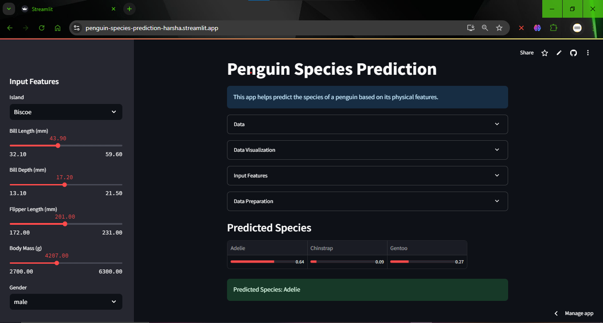

## Machine Learning Streamlit App

### Overview

This project is a **Streamlit-based machine learning app** that uses a **Random Forest** classifier to predict the species of penguins based on various physical features like bill length, bill depth, flipper length, and body mass. The app allows users to input penguin data through a sidebar and view the predicted species along with the probabilities for each species.

The model is trained on a penguin dataset (for example, the **Palmer Penguins dataset**), which contains information about different penguin species along with their physical attributes.

### Table of Contents

1. [Overview](#overview)
2. [Features](#features)
3. [Project Structure](#project-structure)
4. [Dependencies](#dependencies)
5. [Installation](#installation)
6. [How the App Works](#how-the-app-works)
7. [Code Breakdown](#code-breakdown)
8. [Testing](#testing)
9. [Future Improvements](#future-improvements)
10. [License](#license)
11. [App Screenshot](#app-screenshot)

### Features

- **Data visualization**: Visualizes the relationship between features like bill length and body mass using a scatter plot.
- **User input**: The app allows users to input penguin characteristics via the sidebar, including island, bill length, bill depth, flipper length, body mass, and sex.
- **Model training**: A **Random Forest Classifier** is used to predict the species based on input features.
- **Model inference**: The app outputs the predicted species along with the probabilities for each species (Adelie, Chinstrap, Gentoo).
- **Dynamic updates**: The app updates the predicted species and probabilities every time the user changes the input.

### Project Structure

```
.
├── app.py                # Streamlit app that ties everything together
├── src/
│   ├── __init__.py       # Package initialization file
│   ├── data_processing.py# Functions for loading and processing the data
│   ├── model.py          # Functions for training and predicting with the model
│   └── features.py       # Functions for encoding and handling features
├── tests/
│   ├── __init__.py       # Test package initialization
│   └── test_data_processing.py # Test functions for data processing
├── data/
│   └── raw/
│       └── data.csv      # Raw dataset (e.g., Palmer Penguins)
├── requirements.txt      # Python dependencies for the app
├── .gitignore            # Git ignore file
└── README.md             # Project documentation
```

### Dependencies

- **Streamlit**: Web framework for interactive dashboards.
- **Pandas**: Data manipulation and analysis library.
- **NumPy**: Library for numerical computing.
- **Scikit-learn**: Machine learning library for model training.
- **pytest**: Testing framework for unit tests.

To install the dependencies, run:

```bash
pip install -r requirements.txt
```

### Installation

1. **Clone the repository:**

    ```bash
    git clone <repository_url>
    cd <repository_name>
    ```

2. **Install the dependencies:**

    Make sure to have `pip` installed and up to date. Then, run:

    ```bash
    pip install -r requirements.txt
    ```

3. **Running the app:**

    To launch the app in your local environment, run:

    ```bash
    streamlit run app.py
    ```

    This command will start a local development server, and you will be able to access the app through your web browser at the address `http://localhost:8501`.

4. **Running the tests (optional):**

    To run the unit tests for the project, use **pytest**. First, make sure you have pytest installed, then run the following command:

    ```bash
    pytest
    ```

    This will execute the tests in the `tests/` folder and display the results in the terminal.

### How the App Works

1. **Data Loading and Preprocessing:**
   - The dataset is loaded from the `data/raw/data.csv` file using Pandas.
   - Missing values are filled with the mean of the column to ensure the model doesn't encounter issues during training.
   
2. **User Input:**
   - The app presents a sidebar where users can input values for a penguin’s attributes:
     - `Island`: Choose between Biscoe, Dream, or Torgersen.
     - `Bill length (mm)`: A slider to input the penguin’s bill length.
     - `Bill depth (mm)`: A slider for the bill depth.
     - `Flipper length (mm)`: A slider for the penguin's flipper length.
     - `Body mass (g)`: A slider for the penguin's body mass.
     - `Gender`: Choose between male or female.
   
   - These values are used to generate a feature vector, which is then encoded and passed to the model for predictions.

3. **Model Training:**
   - The app uses a **Random Forest Classifier** from Scikit-learn to train the model. The features (`X`) are separated from the target (`y`, species), and the model is trained on this data.
   
4. **Model Inference and Prediction:**
   - Once the model is trained, the app uses the user's input to make a prediction. The app shows the predicted species and the probabilities for each class (`Adelie`, `Chinstrap`, `Gentoo`).
   
5. **Data Visualization:**
   - The app visualizes the dataset’s relationship between body mass and bill length using a scatter plot, colored by species, which provides insight into how the species are distributed based on these features.

### Code Breakdown

- **`app.py`**:
  - This file contains the main Streamlit app logic that handles displaying the UI and interacting with the data and model.
  
- **`src/data_processing.py`**:
  - Contains the `load_and_process_data` function to load the dataset and preprocess it (e.g., handling missing values).
  
- **`src/model.py`**:
  - Includes functions to train the **Random Forest** model (`train_model`) and to predict the species using the trained model (`predict_species`).
  
- **`src/features.py`**:
  - Handles encoding of the input features using one-hot encoding, converting categorical variables like `island` and `sex` into numerical format for the model.
  
- **`tests/`**:
  - Contains unit tests to ensure that the functions in `data_processing.py` work as expected (e.g., ensuring the data is loaded and processed correctly).

### Testing

To ensure the robustness of the app, unit tests are provided for the data processing functions. These tests verify that the data is loaded correctly and that the expected columns are present.

Example of running the test:

```bash
pytest tests/test_data_processing.py
```

### Future Improvements

1. **Model optimization**: Hyperparameter tuning for the Random Forest model to improve performance.
2. **Feature engineering**: Add additional features such as the penguin's age or environmental conditions.
3. **Cross-validation**: Implement cross-validation to ensure that the model generalizes well to new data.
4. **User feedback**: Allow users to provide feedback on predictions, which can be used to further refine the model.
5. **Error handling**: Add more robust error handling for edge cases, such as invalid input data or missing values.

### License

This project is licensed under the MIT License.

### App Screenshot




